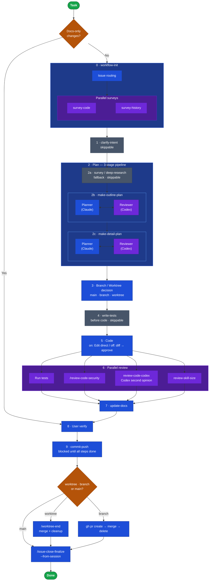

# Nirecode: The self-driving agent coding framework — secure by default, reliable by design
<sub>pronounced "ni-re-code" · for **Claude Code** and **GitHub Copilot**</sub>

- **A self-driving development harness** — hooks enforce research → tests → code → security → docs as a per-session state machine. Concurrent sessions are tracked independently; any session resumes seamlessly across machines.
- **Parallel sessions isolated by construction** — Run multiple features concurrently without stepping on each other. Each task gets its own linked worktree (`<WORKTREE_BASE_DIR>/<task>/<repo>`) with full isolation; writes to the main worktree are blocked by default. Developers preferring a simpler single-session workflow can disable this with `ENFORCE_WORKTREE=off`. See [docs/parallel-sessions.md](docs/parallel-sessions.md).
- **Test cases and security review are scoped to OWASP categories** — codified, not optional.
- **Windows-native, not an afterthought** — Claude Code skews Linux/macOS. This framework ships PowerShell-first installers, hooks, and shell conventions so Windows developers get the full workflow without workarounds.
- **Two AI providers, one planning loop** — inside `/make-outline-plan` and `/make-detail-plan`, Claude drafts and Codex (OpenAI) reviews adversarially, turn by turn, until both agree. The blind spots one model carries, the other catches.
- **One installer, every platform** — Linux, macOS, and Windows (native and WSL2) all handled by a single branching install; hooks and shell rules detect the platform automatically.

Shared CLAUDE.md, rules, hooks, and skills — single source of truth across both tools.
Codex CLI and Gemini CLI are both supported (install with `-Develop`).

## What's Inside

### Hook-enforced end-to-end workflow

Most agent frameworks rely on the model to remember process steps. This framework encodes
the dev workflow — research → plan → write-tests → code → run-tests → security-review →
docs → user-verification — as a per-session state machine. A PreToolUse hook physically
blocks `git commit` until every required step completes or is explicitly skipped with a reason.



- **Evidence-based completion**: staging `tests/` and `docs/*.md` files automatically
  satisfies the corresponding steps — no manual marker required.
- **State inheritance**: after context compaction or a fresh session on the same cwd+branch,
  prior workflow state is inherited so progress is not lost.

> **Note**: `--permission-mode plan` is incompatible with this workflow. In plan mode the
> Skill tool is restricted, so skills such as `/clarify-intent` and `/make-outline-plan`
> cannot be invoked. Always use default mode for implementation tasks.

- **Docs-only short-circuit**: commits that only touch human-facing documentation bypass
  steps 1–6 automatically.

### Private information scanning

Two checkpoints prevent private data from reaching public repositories: a `git pre-commit`
hook and a Claude Code PreToolUse hook. Both detect RFC 1918 addresses, email addresses,
MAC addresses, absolute local paths, hard-coded secrets (AWS, Anthropic, OpenAI, GitHub,
Slack, and others), PEM private keys, and Trojan Source hidden Unicode characters.
Repositories identified as private via `gh api` are skipped automatically.
See [docs/scan-outbound.md](docs/scan-outbound.md) for detection patterns and configuration.
To add private patterns, copy `.private-info-blocklist.example` to `.private-info-blocklist`.

### Cross-machine session continuity

Normalizes Claude Code project paths to drive-root form (`C:\git\`, `/git/`) and syncs
`~/.claude/projects/` through a private GitHub repo — conversations started on Windows can
be resumed on macOS/Linux, and vice versa.

Use `codes [dir]` instead of `code` to open VS Code: it waits for the window to close,
then automatically pushes the session to the sync repo.

### Standards-backed testing and security

Concrete test categories — Normal, Error, Edge, Idempotency, and Security — with citations:
OWASP ASVS V8, OWASP WSTG, CWE Top 25, OWASP LLM Top 10, MCP Top 10. Test layer selection
follows Martin Fowler's narrow/broad integration distinction and Kent C. Dodds' Testing
Trophy. Security skills apply the same references at design time (`/review-plan-security`)
and implementation time (`/review-code-security`). At step 5, `review-code-codex`
also runs an adversarial review via OpenAI Codex CLI (when installed), providing a
second-provider opinion independent of Claude's model-specific biases.

`settings.json` enforces a permission deny-list so Claude cannot execute dangerous
operations even if instructed: force push (`--force`, `-f`, `+<ref>` refspec), direct
`.env` access, bulk deletion (`rm -rf`, `Remove-Item -Recurse`), and AWS destructive
commands. See [docs/security-policy.md](docs/security-policy.md) for the full policy.

### Three-stage planning pipeline

The `plan` step separates *what* from *how* via three sequential skills:
`/clarify-intent` interviews the user to lock in requirements and non-goals;
`/make-outline-plan` runs outline-planner + outline-reviewer subagents to surface
2–3 mutually-exclusive high-level directions (file paths and step sequences explicitly
forbidden — direction only); `/make-detail-plan` runs the planner/reviewer loop seeded with the agreed intent and approach;
each round, Codex reviews the draft first via `review-plan-codex` — Claude's `reviewer` subagent
serves as fallback when Codex is unavailable (SKIPPED/FAILED), with a visible fallback message.
`/make-outline-plan` uses the same codex-first pattern with `--format outline-plan`.

### TDD via subagent isolation

Test writing runs in a `mode: "auto"` subagent restricted to test files only, reducing
user confirmations from O(N) per-edit approvals to exactly two: test plan approval and
final review.

### GitHub Copilot support

`CLAUDE.md` and `rules/` are read natively by Copilot when `chat.useClaudeMdFile: true`
is set — no duplication needed. The existing `settings.json` hooks fire in Copilot too
(same JSON protocol; matchers extended with Copilot tool names). All `skills/` are
available to Copilot via Agent Skills — the `~/.claude/skills` symlink is auto-detected
by Copilot (VS Code 1.108+, 2025-12-18), so no separate prompt files are needed.
The installer configures all required VS Code settings automatically.

See [docs/architecture/copilot.md](docs/architecture/copilot.md) for the full design.

## Directory Structure

```
CLAUDE.md          — global instructions (Claude Code + Copilot)
settings.json      — hooks, permissions, model, and effort-level configuration
rules/             — coding, testing, docs, git, and security conventions
skills/            — slash commands (/clarify-intent, /make-outline-plan, /make-detail-plan, /write-tests, …) for Claude Code and Copilot
copilot/           — Copilot-specific configuration (VS Code settings scripts)
hooks/             — git and Claude Code/Copilot hook scripts
agents/            — agent definition files (planner, reviewer, planner, reviewer, outline-planner, outline-reviewer) — Claude Code only
bin/               — doc-append, doc-rotate, session-sync, scan-outbound, review-code-codex, review-plan-codex, review-loop-cap-menu, review-skill-size, extract-accepted-tradeoffs, and other tools
bin/lib/           — shared bash libraries (codex-core.sh)
install/
  win/             — Windows-specific install subscripts
  linux/           — Linux/macOS install subscripts
install.sh         — Linux/macOS installer
install.ps1        — Windows installer
docs/              — architecture decisions, history, and operational docs
tests/             — test suite for hooks, skills, and framework behaviors
```

## Requirements

### Required

| Tool | Purpose |
|------|---------|
| `git` | Repo clone; `core.hooksPath` is set to the repo's `hooks/` directory |
| `bash` | All shell hooks (`pre-commit`, `commit-msg`) and `bin/` scripts |
| Node.js | All Claude Code hooks in `settings.json` run via `node hooks/*.js` |
| PowerShell 5+ (Windows) | `install.ps1`, symlink creation, session-sync wrapper |
| [Claude Code CLI](https://docs.anthropic.com/en/docs/claude-code) | The framework targets Claude Code; without it, hooks/skills have no host |
| `jq` (≥1.6) | `bin/review-plan-codex`, `bin/review-loop-cap-menu` — round-log JSON encoding and cap-menu output (hard prerequisite; missing jq → early-exit FAILED with install guidance) |

> Windows: symlink creation requires Developer Mode (Settings → System → For developers) or Administrator privileges.

#### jq install

```
# Windows
winget install jqlang.jq

# macOS
brew install jq

# Debian / Ubuntu
sudo apt install jq
```

Reviewer scripts call `codex_core_check_jq` at startup; missing jq results in early exit with the same install commands echoed.

### Optional

| Tool | Used by |
|------|---------|
| [fnm](https://github.com/Schniz/fnm) (Windows) / [nvm](https://github.com/nvm-sh/nvm) (Linux/macOS) | Installer: installs Claude Code and Codex via npm |
| [uv](https://github.com/astral-sh/uv) + Python 3 | `doc-append`, `doc-rotate.py`, `sort-history.py`, `convert-history-table.py` |
| [GitHub CLI (`gh`)](https://cli.github.com/) | Private-repo detection in `hooks/pre-commit` (without it, all repos are scanned conservatively) |
| `osascript` (macOS) / `notify-send` (Linux) | Toast notifications from `bin/session-sync.sh` |

### GitHub Copilot

GitHub Copilot for VS Code is required for Copilot integration. The installer
(`install.ps1` / `install.sh`) writes the required VS Code user settings automatically.

> **Note**: `settings.json` is standard JSON. If your VS Code `settings.json` contains
> comments (JSONC), the installer will warn and skip the merge — remove comments first.

## Install

### Linux / macOS

```bash
git clone https://github.com/nirecom/agents ~/git/agents
cd ~/git/agents && ./install.sh
# Add --develop to also install Codex CLI + Gemini CLI + Mermaid CLI (mmdc)
```

> If nvm was just installed, restart your terminal before re-running `./install.sh` so that Node.js (npm) is available.

Then add to `~/.bash_profile` or `~/.zshrc`:

```bash
source ~/.agents_profile
```

### Windows (PowerShell)

```powershell
git clone https://github.com/nirecom/agents $HOME\git\agents
Set-Location $HOME\git\agents
.\install.ps1
# Add -Develop to also install Codex CLI + Gemini CLI + Mermaid CLI (mmdc)
```

> If fnm was just installed, restart your terminal before re-running `.\install.ps1` so that Node.js (npm) is available.

Then add to your PowerShell profile:

```powershell
. "$HOME\.agents_profile.ps1"
```

## Configuration

Key environment variables set by `dotfileslink`:

| Variable | Value | Purpose |
|----------|-------|---------|
| `AGENTS_CONFIG_DIR` | path to this repo | Resolves hook paths in `settings.json` |
| `AGENTS_DIR` | path to this repo | Resolves `session-sync.sh` path in shell profile |

## Contributing

This is a personal configuration repo. Issues and discussions are welcome; PRs are accepted
for bug fixes and portable improvements. Feature additions that are personal-workflow-specific
are generally out of scope.

## License

MIT
