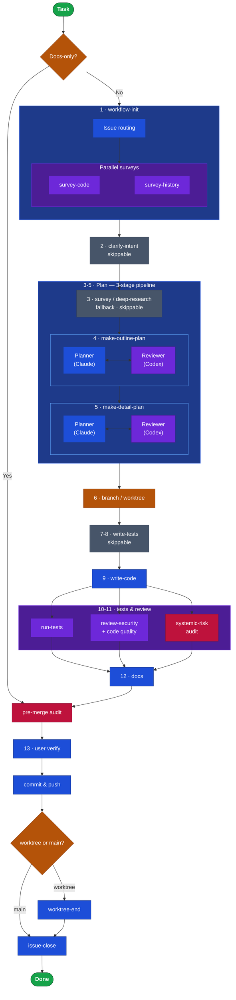

# Nirecode: The self-driving agent coding framework — secure by default, reliable by design
<sub>pronounced "ni-re-code" · for **Claude Code** and **GitHub Copilot**</sub>

## Why Nirecode?
### Self-driving by design

- **A self-driving development harness** — hooks enforce research → tests → code → security → docs as a per-session state machine. Concurrent sessions are tracked independently; any session resumes seamlessly across machines.
- **Worktree-based parallel sessions** — Run multiple features concurrently without stepping on each other. Writes to the main worktree are blocked by default. See [docs/parallel-sessions.md](docs/parallel-sessions.md).

### Built for output quality

- **Two AI providers, one planning loop** — Claude drafts and Codex (OpenAI) reviews adversarially, turn by turn, until both agree. The blind spots one model carries, the other catches.
- **TDD** — tests are written before implementation code. A dedicated subagent handles test authoring in isolation, and the commit hook blocks merging until the test step is satisfied.
- **Test cases and security review are scoped to OWASP categories** — codified, not optional.

### Cross-platform, zero exceptions

- **Windows-native, not an afterthought** — Claude Code skews Linux/macOS. This framework ships PowerShell-first installers, hooks, and shell conventions so Windows developers get the full workflow without workarounds.
- **One installer, every platform** — Linux, macOS, and Windows (native and WSL2) all handled by a single branching install; hooks and shell rules detect the platform automatically.

## Hook-enforced end-to-end workflow

Most agent frameworks rely on the model to remember process steps. This framework encodes
the dev workflow as a deterministic next-step-driven state machine. After each skill completes,
the model queries `bin/workflow/next-step` for the next step; a PreToolUse hook physically
blocks `git commit` until every required step completes or is explicitly skipped with a reason.

The same state machine runs in several modes depending on the work. **WF-CODE** is the standard
implementation flow with all 16 steps active; **WF-META** is a planning-only variant for
meta-label issues that auto-skips the implementation steps (7–14). The full per-mode step lists
live in [docs/architecture/claude-code/workflow.md](docs/architecture/claude-code/workflow.md#workflow-types-in-next-step---list).


```mermaid
flowchart TD
    classDef terminal  fill:#16a34a,stroke:#14532d,color:#fff,font-weight:bold
    classDef decision  fill:#b45309,stroke:#92400e,color:#fff
    classDef audit     fill:#be123c,stroke:#881337,color:#fff
    classDef skippable fill:#475569,stroke:#334155,color:#fff
    classDef parallel  fill:#6d28d9,stroke:#4c1d95,color:#fff
    classDef required  fill:#1d4ed8,stroke:#1e3a8a,color:#fff

    Task([Task]) --> Doc{Docs-only?}
    Doc -- Yes --> Gate
    Doc -- No  --> S0_sg

    subgraph S0_sg["1 · workflow-init"]
        direction TB
        S0_R["Issue routing"]
        subgraph S0_surv["Parallel surveys"]
            direction LR
            S0_SC["survey-code"] ~~~ S0_SH["survey-history"]
        end
        S0_R --> S0_surv
    end

    S0_sg --> S1["2 · clarify-intent<br/>skippable"]
    S1 --> P2a

    subgraph Plan["3-5 · Plan  —  3-stage pipeline"]
        direction TB
        P2a["3 · survey / deep-research<br/>fallback · skippable"] --> P2b_sg
        subgraph P2b_sg["4 · make-outline-plan"]
            direction LR
            P2b_L["Planner<br/>(Claude)"] <--> P2b_R["Reviewer<br/>(Codex)"]
        end
        P2b_sg --> P2c_sg
        subgraph P2c_sg["5 · make-detail-plan"]
            direction LR
            P2c_L["Planner<br/>(Claude)"] <--> P2c_R["Reviewer<br/>(Codex)"]
        end
    end

    Plan --> S3["6 · branch / worktree"]
    S3 --> S4["7-8 · write-tests<br/>skippable"]
    S4 --> S5["9 · write-code"]

    S5 --> S6a & S6b & SR

    subgraph Review["10-11 · tests & review"]
        S6a["run-tests"]
        S6b["review-security<br/>+ code quality"]
        SR["systemic-risk<br/>audit"]
    end

    S6a & S6b & SR --> S7["12 · docs"]
    S7 --> Gate["pre-merge audit"]
    Gate --> UV["13 · user verify"]
    UV --> Push["commit & push"]

    Push --> Clean{worktree or main?}
    Clean -- worktree --> WE["worktree-end"]
    Clean -- main     --> IC["issue-close"]
    WE --> IC
    IC --> Done([Done])

    style S0_sg  fill:#1e3a8a,stroke:#1d4ed8,color:#fff
    style S0_surv fill:#4c1d95,stroke:#6d28d9,color:#fff
    style Plan   fill:#1e3a8a,stroke:#1d4ed8,color:#fff
    style P2b_sg fill:#1e3a8a,stroke:#60a5fa,color:#fff
    style P2c_sg fill:#1e3a8a,stroke:#60a5fa,color:#fff
    style Review fill:#4c1d95,stroke:#6d28d9,color:#fff

    class Task,Done terminal
    class Doc,Clean,S3 decision
    class Gate,SR audit
    class S1,P2a,S4 skippable
    class S0_SC,S0_SH,P2b_R,P2c_R,S6a,S6b parallel
    class S0_R,P2b_L,P2c_L,S5,S7,UV,Push,WE,IC required
```

- **Evidence-based completion**: staging `tests/` and `docs/*.md` files automatically
  satisfies the corresponding steps — no manual marker required.
- **State inheritance**: after context compaction or a resumed session with provable
  transcript descent from a prior one (same cwd+branch alone is not enough), prior workflow
  state is inherited so progress is not lost. A session that lost its own id outright (crash
  recovery) can adopt prior state explicitly via `bin/workflow/adopt-session-state`.

> **Note**: `--permission-mode plan` is incompatible with this workflow. In plan mode the
> Skill tool is restricted, so skills such as `/clarify-intent` and `/make-outline-plan`
> cannot be invoked. Always use default mode for implementation tasks.

- **Docs-only short-circuit**: commits that only touch human-facing documentation bypass
  steps 1–6 automatically.

## Quickstart

One branching installer covers every platform (Linux, macOS, Windows native and WSL2) and
installs the dependencies it needs (full list under [Requirements](#requirements)). Install once,
source the generated profile, then launch VS Code with the `codes` command — the workflow hooks
activate automatically.

### Install

**Linux / macOS**

```bash
git clone https://github.com/nirecom/agents ~/git/agents
cd ~/git/agents && ./install.sh
```

> If nvm was just installed, restart your terminal before re-running `./install.sh` so that Node.js (npm) is available.

The installer appends the profile sourcing to your shell rc file (`~/.bashrc`, `~/.zshrc`, or
`~/.profile`) automatically — open a new terminal afterward to load it.

**Windows (PowerShell)**

```powershell
git clone https://github.com/nirecom/agents $HOME\git\agents
Set-Location $HOME\git\agents
.\install.ps1
```

> If fnm was just installed, restart your terminal before re-running `.\install.ps1` so that Node.js (npm) is available.

The installer appends the profile sourcing to your PowerShell `$PROFILE` automatically — open a
new terminal afterward to load it. It also enables git long-path support (`core.longpaths`) so
deep worktree paths don't hit the Windows `Filename too long` limit.

**Configure and authenticate**

Sourcing the profile exports `AGENTS_CONFIG_DIR` / `AGENTS_DIR` for you — no manual setup. All
tunable behavior lives in `.env`: copy the template (`cp .env.example .env`) and edit as needed.
`.env.example` documents every setting inline; any repo can override a subset via a `.env.local`
at its root — see [Configuration](#configuration) for details.

On the first interactive run the installer invokes `gh auth login` when not already authenticated
(skipped on headless/CI machines and on already-authenticated re-runs), then `gh auth refresh -s
project` adds the required `project` scope automatically.

### Launch

Sourcing the profile defines the **`codes`** command — the way to start a session. It opens VS Code
wired to the framework (CLAUDE.md, hooks, skills, and the pinned Claude model versions from `.env`
all in effect) and pushes the session-sync repo when the window closes:

```bash
codes                # open the current directory
codes path/to/repo   # open a specific repo or .code-workspace
```

Inside VS Code, start Claude Code (or GitHub Copilot) as usual — the hook-enforced workflow is
already active. `codes` works identically in bash (`bin/codes-launch.sh`) and PowerShell
(`bin/codes-launch.ps1`).

### Sentinels

The same hook that blocks `git commit` uses **sentinels** to know when a step is
complete. During a session you may be asked to approve a command like:

```
echo "<<WORKFLOW_USER_VERIFIED: issue #123 reviewed and confirmed>>"
```

Sentinels are marker strings of the form `<<WORKFLOW_...>>` that hooks detect to drive
workflow state transitions — step completions, skip declarations, mode switches. The
`ask` permission dialog is intentional: it ensures the model cannot mark a step done
or override a gate without explicit user confirmation.

See [docs/glossary.md](docs/glossary.md) and [docs/architecture/claude-code/workflow-runtime.md](docs/architecture/claude-code/workflow-runtime.md) for details.

## Features

### Three-stage planning pipeline

The `plan` step separates *what* from *how* via three sequential skills:
`/clarify-intent` interviews the user to lock in requirements and non-goals;
`/make-outline-plan` runs outline-planner + outline-reviewer subagents to surface
2–3 mutually-exclusive high-level directions (file paths and step sequences explicitly
forbidden — direction only); `/make-detail-plan` runs the planner/reviewer loop seeded with the agreed intent and approach;
each round, Codex reviews the draft first via `review-plan-codex` — Claude's `reviewer` subagent
serves as fallback when Codex is unavailable (SKIPPED/FAILED), with a visible fallback message.
`/make-outline-plan` uses the same codex-first pattern with `--format outline-plan`.

### Standards-backed testing and security

Concrete test categories — Normal, Error, Edge, Idempotency, and Security — with citations:
OWASP ASVS V8, OWASP WSTG, CWE Top 25, OWASP LLM Top 10, MCP Top 10. Test layer selection
follows Martin Fowler's narrow/broad integration distinction and Kent C. Dodds' Testing
Trophy. Security skills apply the same references at design time (`/review-plan-security`)
and implementation time (`/review-code-security`). At step 5, `review-code-codex`
also runs an adversarial review via OpenAI Codex CLI, providing a second-provider opinion
independent of Claude's model-specific biases. A reviewed project can declare its own
non-functional requirements once, in a gitignored `.env.local` at its root, and every
codex review prompt injects them automatically.

More generally, `.env` holds this machine's global defaults and a reviewed project's
own `.env.local` can override most of them for that project alone — except a small
set of settings (workflow-state paths, the config directory itself, worktree
enforcement, the codex NFR size caps) that stay machine-wide no matter what a
project's `.env.local` says. See
[docs/architecture/claude-code/local-env-overrides.md](docs/architecture/claude-code/local-env-overrides.md)
for the full list and the reasoning behind each entry.

`settings.json` enforces a permission deny-list so Claude cannot execute dangerous
operations even if instructed: force push (`--force`, `-f`, `+<ref>` refspec), direct
`.env` access, bulk deletion (`rm -rf`, `Remove-Item -Recurse`), and AWS destructive
commands. See [docs/security-policy.md](docs/security-policy.md) for the full policy.

### GitHub Copilot support

`CLAUDE.md` and `rules/` are read natively by Copilot when `chat.useClaudeMdFile: true`
is set — no duplication needed. The existing `settings.json` hooks fire in Copilot too
(same JSON protocol; matchers extended with Copilot tool names). All `skills/` are
available to Copilot via Agent Skills — the `~/.claude/skills` symlink is auto-detected
by Copilot (VS Code 1.108+, 2025-12-18), so no separate prompt files are needed.
The installer configures all required VS Code settings automatically.

See [docs/architecture/copilot.md](docs/architecture/copilot.md) for the full design.

### GitLab support

github.com and gitlab.com are recognized automatically; name a self-hosted GitLab
host in `FORGE_GITLAB_HOST` to have its remotes handled as GitLab (merge requests,
repo visibility, and label-based WIP signaling). An unrecognized host is never
treated as GitHub — it is skipped, not misrouted.

See [docs/architecture/gitlab-support.md](docs/architecture/gitlab-support.md) for the full design.

### Cross-machine session continuity

Normalizes Claude Code project paths to drive-root form (`C:\git\`, `/git/`) and syncs
`~/.claude/projects/` through a private GitHub repo — conversations started on Windows can
be resumed on macOS/Linux, and vice versa.

Use `codes [dir]` instead of `code` to open VS Code: it waits for the window to close,
then automatically pushes the session to the sync repo.

### Private information scanning

Two checkpoints prevent private data from reaching public repositories: a `git pre-commit`
hook and a Claude Code PreToolUse hook. Both detect RFC 1918 addresses, email addresses,
MAC addresses, absolute local paths, hard-coded secrets (AWS, Anthropic, OpenAI, GitHub,
Slack, and others), PEM private keys, and Trojan Source hidden Unicode characters.
Repositories identified as private via `gh api` are skipped automatically. For `gh issue`/`pr`
writes, visibility is resolved from the **target** repository (not just the current directory),
and writes to public repositories are additionally checked for private-repo name leaks.
A companion offensive-content filter (`bin/scan-offensive`) checks all `gh issue`/`pr`
writes for hate speech, slurs, harassment, and profanity — active for all repos (public
and private). Copy `.offensive-content-blocklist.example` to `.offensive-content-blocklist`
and add patterns; optionally set `ANTHROPIC_API_KEY` to enable LLM-assisted borderline
classification. Use `/scan-offensive` to retroactively scan and redact offensive content
in any GitHub repo's issues and comments.
See [docs/scan-outbound.md](docs/scan-outbound.md) for detection patterns and configuration.
To add private patterns, copy `.private-info-blocklist.example` to `.private-info-blocklist`.

### On-demand rules loading

A rule file with no `paths:` frontmatter is injected into *every* session, whether or not
the session will ever act on it. Rules that only one skill needs — testing, documentation,
and GitHub-issue conventions — instead declare the reserved never-match glob plus an
`<!-- injection: on-demand-only -->` marker, and the owning skills Read them explicitly at
the point of use. Session context shrinks by everything those files used to occupy.

Two guards keep the convention honest: `bin/check-on-demand-rules.sh` runs from the
pre-commit hook and fails the commit when a rule carries only one half of the notation or
when a skill that needs a de-injected rule has no Read step, and the
`instructions-loaded-audit.js` hook observes what a live session actually loaded and
records a verdict when a rule went missing, arrived malformed, or leaked a path.

See [docs/architecture/claude-code/rules-injection.md](docs/architecture/claude-code/rules-injection.md).

### VS Code worktree session visibility

A patch tool (`bin/vscode-cc-repair/index.js`) fixes the Claude Code extension's hardcoded
`includeWorktrees:!1`, which hides worktree sessions from the session list and is
overwritten on every extension auto-upgrade. See [docs/vscode-worktree-repair.md](docs/vscode-worktree-repair.md).

## Directory Structure

- `CLAUDE.md` — global instructions, read natively by both Claude Code and Copilot
- `settings.json` — base hook/permission/model config; the installer merges it with `settings-extension.json` and generated allow rules, then writes the result to `~/.claude/settings.json` as a real file (not a symlink)
- `rules/` — coding, testing, docs, git, and security conventions
- `skills/` — slash commands (`/clarify-intent`, `/make-outline-plan`, `/write-tests`, …)
- `agents/` — subagent definitions for judgement-heavy work (planners, reviewers, survey, supervisor)
- `hooks/` — the git and Claude Code/Copilot hooks that drive the workflow state machine
- `bin/` — supporting CLIs and deterministic workers invoked by the hooks and skills
- `install/`, `install.sh`, `install.ps1` — one branching cross-platform installer
- `docs/` — architecture decisions, history, and operational docs
- `tests/` — test suite for hooks, skills, and framework behaviors

## Requirements

The installer brings in everything marked **✓** automatically; the rest must already be present before you run it.

### Required

| Tool | Purpose | Installed by the installer |
|------|---------|:--:|
| `git` | Repo clone; `core.hooksPath` is set to the repo's `hooks/` directory | — (needed to clone the repo first) |
| `bash` | All shell hooks (`pre-commit`, `commit-msg`) and `bin/` scripts | — |
| PowerShell 5+ (Windows) | Bootstraps `install.ps1` | — (needed to run the installer) |
| Node.js | All Claude Code hooks in `settings.json` run via `node hooks/*.js` | ✓ (installs `nvm`/`fnm`, then Node via npm) |
| [Claude Code CLI](https://docs.anthropic.com/en/docs/claude-code) | The framework targets Claude Code; without it, hooks/skills have no host | ✓ |
| `jq` (≥1.6) | JSON encoding in `bin/review-plan-codex` and the doc-append pipeline | ✓ |
| [GitHub CLI (`gh`)](https://cli.github.com/) | Issue/PR operations, private-repo detection, and Projects v2 throughout the workflow | ✓ (run `gh auth refresh -s project` for the `project` scope) |
| Codex CLI | Adversarial second-provider review in the planning loop and `/review-*-codex`. When Codex is unavailable — not authenticated, token expired, or offline — reviews fall back to Claude reviewer subagents. | ✓ |

> Windows: symlink creation requires Developer Mode (Settings → System → For developers) or Administrator privileges.

### Optional

| Tool | Used by | Installed by the installer |
|------|---------|:--:|
| [uv](https://github.com/astral-sh/uv) + Python 3 | `doc-append`, `doc-rotate.py`, `sort-history.py`, `convert-history-table.py` | — |
| [CodeGraph](https://www.npmjs.com/package/@colbymchenry/codegraph) | Third-party code-intelligence: a pre-built symbol graph agents query instead of a Read/Grep sweep | ✓ wired in, but off by default — set `CODEGRAPH=on` in `.env` and re-run the installer ([docs](docs/codegraph.md)) |

## Configuration

All tunable behavior is driven by `.env`, created from `.env.example` during [Quickstart](#quickstart).
The template documents every setting inline; the sections below cover only what needs framing.

### Global vs. per-repo

- **Global** — `.env` at this repo's root is the single source of truth for every setting.
- **Per-repo override** — any repo you work in may drop a `.env.local` at its root to override a
  subset of settings for that repo only. A blocklist (`hooks/lib/local-env.js`) pins the settings
  whose per-repo divergence would break the framework's own contract — `AGENTS_CONFIG_DIR`,
  `ENFORCE_WORKTREE`, `WORKFLOW_PLANS_DIR`, and similar — so those always resolve from the global `.env`.

## Contributing

This is a personal configuration repo. Issues and discussions are welcome; PRs are accepted
for bug fixes and portable improvements. Feature additions that are personal-workflow-specific
are generally out of scope.

### License

MIT
